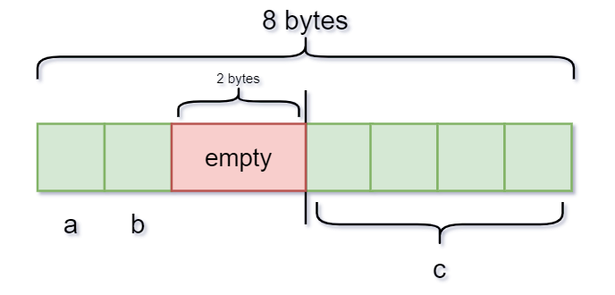
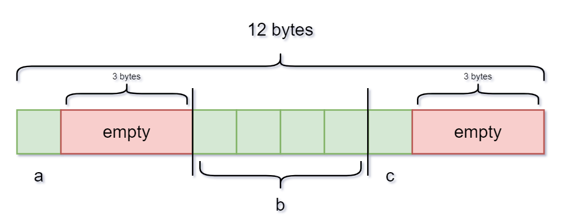

# Struct - Union

## Contents
- [Introduction](#Introduction)
  - [Struct](#struct)
  - [Union](#union)
- [How to declare and use them in C ?](#how-to-declare-and-use-them-in-c-?)
  - [Declare a Struct ?](#declare-a-struct-?)
  - [Declare a Union ?](#declare-a-union-?)
- [How to access members of Struct - Union](#su-dung)
  - [Struct](#cach-1)
  - [Union](#cach-2)
- [Examples and applications of Struct - Union](#dong-gop)
  - [Struct](#yeu-cau)
  - [Union](#quy-trinh-dong-gop)

## Introduction
Đây là dự án mẫu để minh họa cách tạo mục lục trong tệp README. Dưới đây là các mục con trong phần Giới thiệu:

### Struct
Nội dung mục 1...

### Union
Nội dung mục 2...

## How to declare and use them in C ?
Dưới đây là các bước để cài đặt dự án. Bạn có thể tạo các mục con tương tự như trong phần Giới thiệu:

### Declare a Struct ?
Nội dung bước 1...

### Declare a Union ?
-The syntax is as follows
~~~cpp
union Unionname {
   type1 variable1;
   type2 variable2;
   ...
   type variable;
}; 
~~~
-For example,
~~~cpp
#include<stdio.h>

union Hardware
{
   float _cpu;
   short _ram;
   int	 _ssd;
};
int main()
{
   Hardware latop;
   h._cpu = 3.2f;
   h._ram = 256;
   h._ssd = 1024;
   return 0;
}
~~~

## Sử dụng
Đây là cách sử dụng dự án. Cũng tương tự như các phần trước, bạn có thể tạo các mục con cho phần này:

### Cách 1
Nội dung cách 1...

### Cách 2
Nội dung cách 2...

## Đóng góp
Nếu bạn muốn đóng góp vào dự án, hãy làm theo các bước sau. Bạn cũng có thể tạo các mục con như đã thực hiện trong các phần trước:

### Yêu cầu
Nội dung yêu cầu...

### Quy trình đóng góp
Nội dung quy trình đóng góp...

# Problem: *Structure Padding*
- Architecture of a computer processor is such a way that it can read 1 word from memory at a time.
- 1 word is equal to 4 bytes for 32 bit processor and 8 bytes for 64 bit processor. So, 32 bit processor always reads 4 bytes at a time and 64 bit processor always reads 8 bytes at a time => *This concept is very useful to increase the processor speed.*

 **Giả sử 2 ví dụ bên dưới sử dụng `prossesor là 32 bit`**.
Mỗi `Ô VUÔNG` là 1 byte.
 
`Ví dụ 1:`
~~~cpp
#include <stdio.h>

struct example_1 {
   char a; // 1byte
   char b; // 1byte
   int c;  // 4bybtes
};

int main()
{
   struct example_1 variable_name;
   printf("%d",sizeof(variable_name));
}
~~~

**Output:**
~~~cpp
8
~~~

    

`Ví dụ 2:`
~~~cpp
#include <stdio.h>

struct example_2 {
   char a;  // 1byte
   int b;   // 4byte
   char c;  // 1bybtes
};

int main()
{
   struct example_2 variable_name;
   printf("%d",sizeof(variable_name));
}
~~~

**Output:**
~~~cpp
12
~~~

    

# Union chỉ được sử dụng vùng nhớ lưu 1 giá trị  tại 1 thời điểm 
Ví dụ:
Nếu ta khai báo 1 kiểu "union GPIO"
 ~~~cpp
include<stdio.h>

union GPIO {
  uint8_t INPUT;
  uint8_t OUTPUT;
};

int main()
{
  //PC13 là 1 chân GPIO (Port C) của stm32.
  union GPIO PC13;
  //Ta chỉ có thể sử dụng INPUT or OUTPUT tại 1 thời điểm (do kiểu union thì các biến thành viên dùng chunng 1 vị trí để lưu trữ).
  PC13.INPUT = 1 (or 0) // PC.OUTPUT = 1 or 0
  //Sau câu lệnh PC13.INPUT = 1 thì vùng nhớ Union sẽ chứa giá trị là 0x01.
    
  //Nếu sử dụng của 2 thì nó sẽ lưu giá trị của câu lệnh cuối cùng.
  PC13.INPUT = 1;
  PC13.OUTPUT = 0;
  //Sau 2 câu lệnh trên thì vùng nhớ Union sẽ chứa giá trị 0x00.
  return 0;
}

~~~
