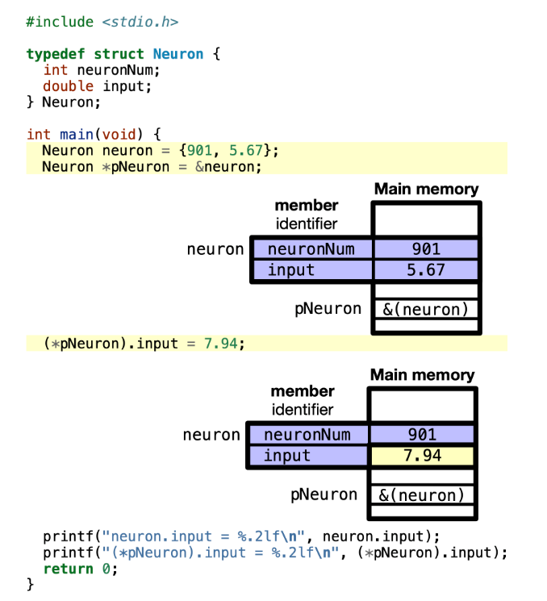
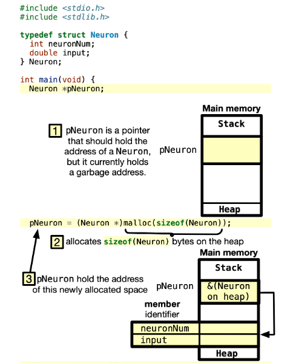
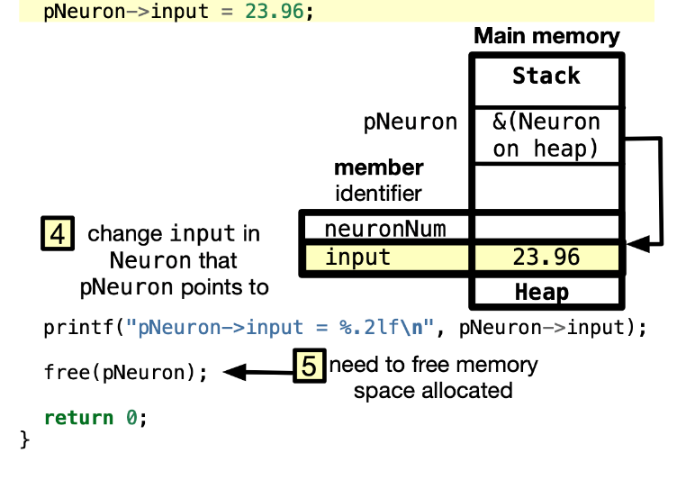
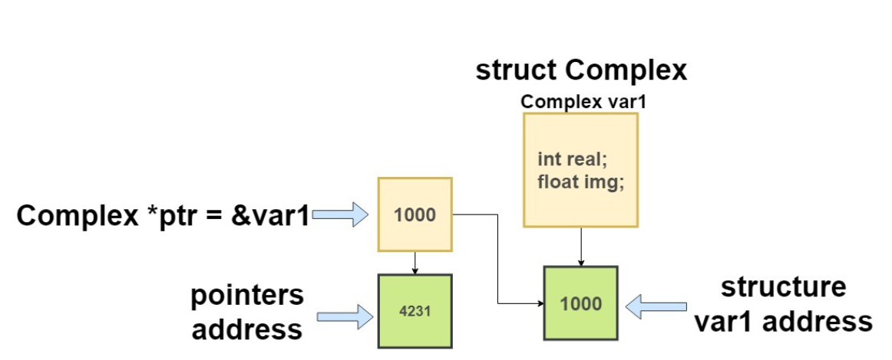
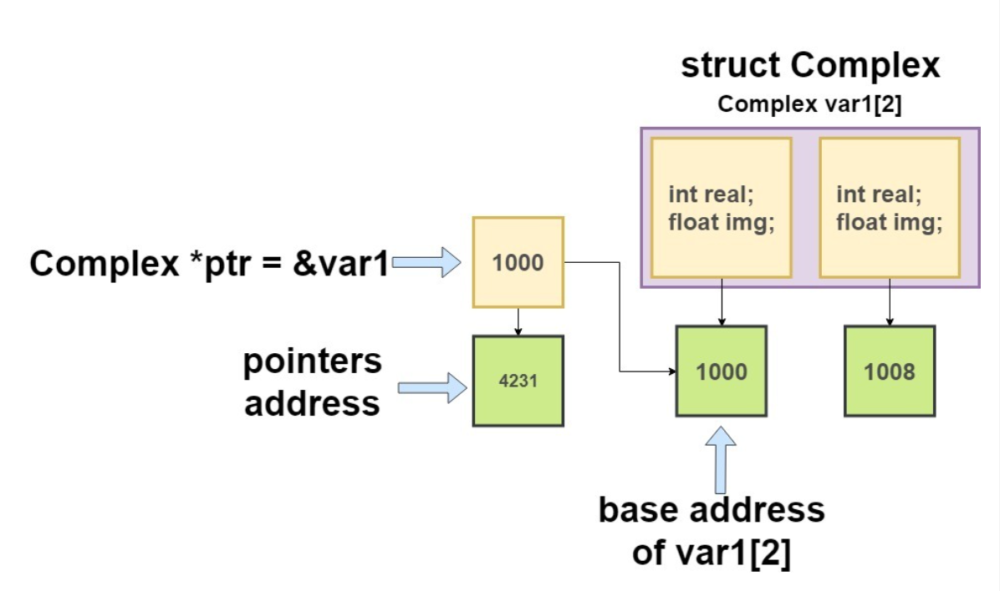

# Pointers to Data Structures
**Reference:**
- [Pointers to Data Structures](https://learningc.org/chapters/chapter12-data-structures/pointers-to-data-structure)
## Access members of data structures through pointers
We can have pointers to declared variables of data structures. For example, in the following code, we define a data structure `struct Neuron`, and create an alias for it named `Neuron`.

Then, we declare a variable `neuron` of type `Neuron`, and a pointer `pNeuron` of type `Neuron *`. The address of `neuron` is assigned to `pNeuron`. The following figure shows the code, the memory layout, and the output.

**Code**

    

**Output**:
~~~cpp
neuron.input = 7.94
(*pNeuron).input = 7.94
~~~

## Dynamic memory allocation of data structures
We can also dynamically allocate memory for data structures. For example, we can allocate memory for a data structure `Neuron` using the `malloc` function. The following figure shows the code, the memory layout, and the output.
~~~cpp
#include <stdio.h>
#include <stdlib.h>

typedef struct Neuron {
  int neuronNum;
  double input;
} Neuron;

int main(void) {
  Neuron *pNeuron;
  pNeuron = (Neuron *)malloc(sizeof(Neuron));

  pNeuron->input = 23.96;
  printf("pNeuron->input = %.2lf\n", pNeuron->input);

  free(pNeuron);
  pNeuron = NULL;  // Avoid dangling pointer
  return 0;
}
~~~

    

    

**Output**:
~~~cpp
pNeuron->input = 23.96 
~~~

# Exercise
**Output: Bai1.c**
~~~cpp
Size of struct SinhVien: 28 bytes
Size of pointer struct: 8 bytes

Thong tin sinh vien:
Ten: Nguyen Dang Trieu
Tuoi: 23
Diem trung binh: 8.50
~~~

---

**Reference**: [Pointer to Struture](https://ee.hawaii.edu/~tep/EE160/Book/chap12/subsection2.1.1.4.html) 

**File Directory Tree: Bai2**  
|-- lbl.h  
|-- lblutil.h  
|-- lbl.c  
|-- lblutil.c  

**Ouput: run_code.c**
~~~cpp
Enter Name <First Middle Last>, EOF to quit: A B C
Enter Street Address: 77 LeLoi Street
Enter City State Zip: BinhDinh AnLacDong 16354

Label Data:

A B C
77 LeLoi Street

BinhDinh AnLacDong 16354
~~~

----
**Ouput: Bai3.c**
~~~cpp
Real part: 5
Imaginary part: 0.33
~~~

    

----
**Ouput: Bai4.c**
~~~cpp
Real part of  array element1 : 5
Imaginary part of array element1 : 0.33
Real part of  array element2 : 7
Imaginary part of array element2 : 0.56
~~~

    

